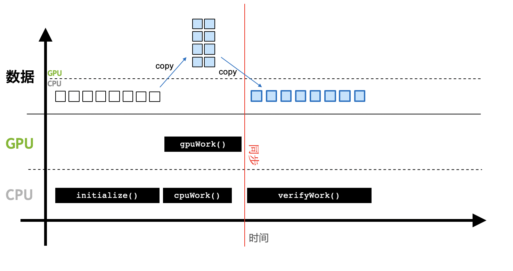
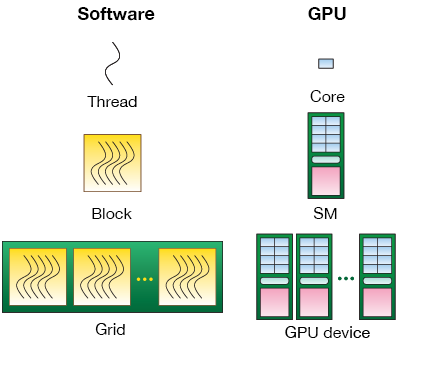
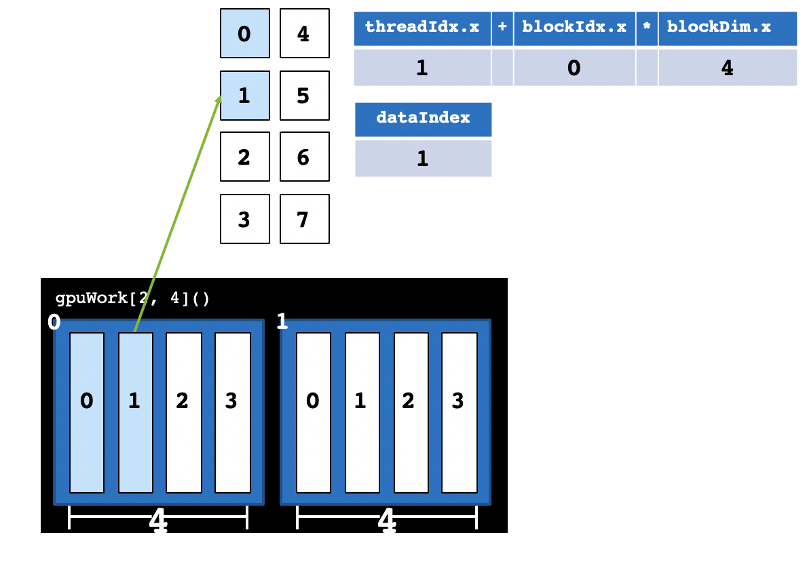
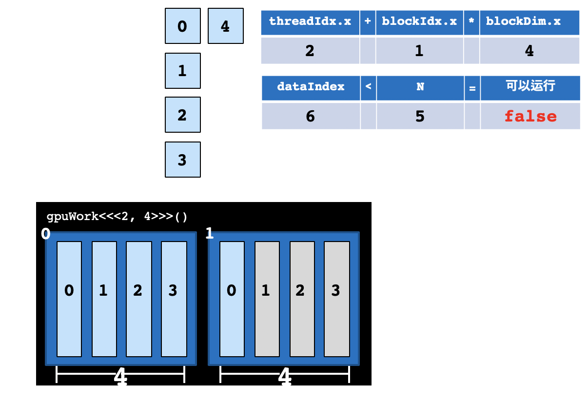
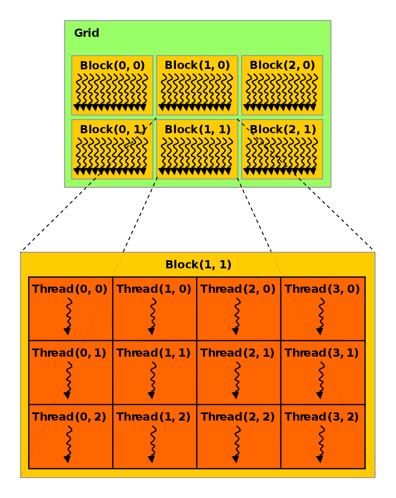
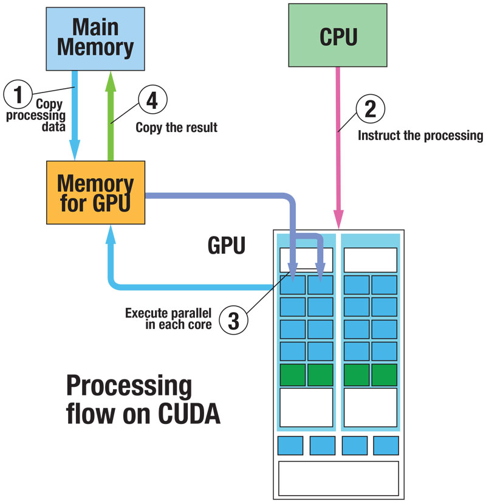

## 初识GPU编程

在[GPU软硬件基础知识](/gpu/gpu-basic/gpu.html)部分我们介绍过一些概念，这里我们再次重申一些GPU编程时所涉及的重要概念。

在CUDA中，CPU和主存被称为**主机（Host）**，GPU和显存（显卡内存）被称为**设备（Device）**，CPU无法直接读取显存数据，GPU无法直接读取主存数据，主机与设备必须通过总线（Bus）相互通信。


*GPU和CPU*

在进行GPU编程前，需要先确认是否安装了CUDA工具箱，可以使用`echo $CUDA_HOME`检查CUDA环境变量，返回值不为空说明已经安装好CUDA。也可以直接用Anaconda里的`conda`命令安装CUDA：

```bash
$ conda install cudatoolkit
```

然后可以使用`nvidia-smi`命令查看显卡情况，比如这台机器上几张显卡，CUDA版本，显卡上运行的进程等。我这里是一台32GB显存版的Telsa V100机器。


*nvidia-smi命令返回结果*

安装好CUDA之后，继续安装Numba库：

```bash
$ conda install numba
```

检查一下CUDA和Numba是否安装成功：

```python
from numba import cuda
print(cuda.gpus)
```

如果上述步骤没有问题，可以得到结果：`<Managed Device 0>...`。如果机器上没有GPU或没安装好上述包，会有报错。CUDA程序执行时会独霸一张卡，如果你的机器上有多张GPU卡，CUDA默认会选用0号卡。如果你与其他人共用这台机器，最好协商好谁在用哪张卡。一般使用`CUDA_VISIBLE_DEVICES`这个环境变量来选择某张卡。如选择5号GPU卡运行你的程序。

```bash
CUDA_VISIBLE_DEVICES='5' python example.py
```

如果手头暂时没有GPU设备，Numba提供了一个模拟器，供用户学习和调试，只需要在命令行里添加一个环境变量。

**Mac/Linux:**

```bash
export NUMBA_ENABLE_CUDASIM=1
```

**Windows:**

```bash
SET NUMBA_ENABLE_CUDASIM=1
```

需要注意的是，模拟器只是一个调试的工具，在模拟器中使用Numba并不能加速程序，有可能速度更慢，而且在模拟器能够运行的程序，并不能保证一定能在真正的GPU上运行，最终还是要以GPU为准。

有了以上的准备工作，我们就可以开始我们的GPU编程之旅了！

## GPU程序与CPU程序的区别

一个传统的CPU程序的执行顺序如下图所示：


*CPU程序执行流程*

CPU程序是顺序执行的，一般需要：

1. 初始化。

2. CPU计算。

3. 得到计算结果。

在CUDA编程中，CPU和主存被称为主机（Host），GPU被称为设备（Device）。


*GPU程序执行流程*

当引入GPU后，计算流程变为：

1. 初始化，并将必要的数据拷贝到GPU设备的显存上。
2. CPU调用GPU函数，启动GPU多个核心同时进行计算。
3. CPU与GPU异步计算。
4. 将GPU计算结果拷贝回主机端，得到计算结果。

一个名为`gpu_print.py`的GPU程序如下所示：

```python
from numba import cuda

def cpu_print():
    print("print by cpu.")

@cuda.jit
def gpu_print():
    # GPU核函数
    print("print by gpu.")

def main():
    gpu_print[1, 2]()
    cuda.synchronize()
    cpu_print()

if __name__ == "__main__":
    main()
```

使用`CUDA_VISIBLE_DEVICES='0' python gpu_print.py`执行这段代码，得到的结果为：

```
print by gpu.
print by gpu.
print by cpu.
```

与传统的Python CPU代码不同的是：

* 使用`from numba import cuda`引入`cuda`库
* 在GPU函数上添加`@cuda.jit`装饰符，表示该函数是一个在GPU设备上运行的函数，GPU函数又被称为**核函数**。
* 主函数调用GPU核函数时，需要添加如`[1, 2]`这样的**执行配置**，这个配置是在告知GPU以多大的并行粒度同时进行计算。`gpu_print[1, 2]()`表示同时开启2个线程并行地执行`gpu_print`函数，函数将被并行地执行2次。下文会深入探讨如何设置执行配置。
* GPU核函数的启动方式是**异步**的：启动GPU函数后，CPU不会等待GPU函数执行完毕才执行下一行代码。必要时，需要调用`cuda.synchronize()`，告知CPU等待GPU执行完核函数后，再进行CPU端后续计算。这个过程被称为**同步**，也就是GPU执行流程图中的红线部分。如果不调用`cuda.synchronize()`函数，执行结果也将改变，`cpu_print`函数将先被执行。虽然GPU函数在前，但是程序并没有等待GPU函数执行完，而是继续执行后面的`cpu_print`函数，由于CPU调用GPU有一定的延迟，反而后面的`cpu_print`先被执行，因此`cpu_print`的结果先被打印了出来。

前面的程序中，核函数被GPU并行地执行了2次。我们可以理解成，核函数以并行线程的方式来执行计算。

对于线程和并行计算不熟悉的朋友，这里再次做一个说明。我们仍然以加法计算为例，CPU就像大学数学教授，GPU就像几千个小学生，现在需要不借助外界，只通过纸笔，对2000个数字进行加法计算，得到1000个加法结果，在这个过程中，大学教授要协调指挥小学生完成任务。

在计算过程中，每个小学生需要按照大学教授的提出的规范，基于一个加法函数，完成计算。每个小学生就像GPU的一个计算核心，加法函数就是核函数，一个小学生完成本次计算就像一次线程计算。在整个计算过程中，只能通过纸笔交流，无论是计算任务本身，还是计算的中间结果都需要落地到纸上进行计算，作为记录的纸就像是计算机中的存储，

假设我们有2000个数字需要加到一起，得到1000个加法结果。如果只依赖20个大学教授，那每个教授需要执行50次计算，耗时很长。如果大学教授可以借助1000个小学生同时计算，那么大学教授可以这样设计GPU并行算法：

1. 设计一个加法函数，加法函数可以将两个数字加在一起。
2. 每个小学生分配2个数字，使用加法函数，对这2个数字执行计算。
3. 大学教授给1000个小学生分配数字，并告知他们使用怎样的加法函数进行计算。
4. 1000个小学生同时计算，得到1000个结果数字，写到纸上，返回给大学教授。

实际上，CUDA并行算法和上面的流程基本相似，就是设计核函数，在存储上合理分配数据，告知GPU以一定的并行度执行配置来并行计算。核函数的设计与所要解决的问题本身高度相关。接下来要重点讲解CUDA如何将核函数以线程的形式并行地执行。

## Thread层次结构

在进行GPU并行编程时，需要定义执行配置来告知以怎样的方式去并行执行核函数。比如上面打印的例子中，是并行地执行2次，还是8次，还是并行地执行20万次，或者2000万次。2000万的数字太大，远远多于GPU的核心数，如何将2000万次计算合理分配到所有GPU核心上。解决这些问题就需要弄明白CUDA的Thread层次结构。


*并行执行8次的执行配置*

CUDA将核函数所定义的运算称为**线程（Thread）**，多个线程组成一个**块（Block）**，多个块组成**网格（Grid）**。这样一个Grid可以定义成千上万个线程，也就解决了并行执行上万次操作的问题。例如，把前面的程序改为并行执行8次：可以用2个Block，每个Block中有4个Thread。原来的代码可以改为`gpu_print[2, 4]()`，其中方括号中第一个数字表示整个Grid有多少个Block，方括号中第二个数字表示一个Block有多少个Thread。

实际上，线程（Thread）是一个编程上的软件概念。从硬件来看，Thread运行在一个CUDA核心上，多个Thread组成的Block运行在Streaming Multiprocessor（SM），SM的概念详见[GPU软硬件介绍](/gpu/gpu-basic/gpu.html#英伟达gpu硬件架构)，多个Block组成的Grid运行在一个GPU显卡上。


*软硬件对应关系：Thread运行在一个核心上，Block运行在SM上，Grid运行在整个GPU卡上*

CUDA提供了一系列内置变量，以记录Thread和Block的大小及索引下标。以`[2, 4]`这样的配置为例：`blockDim.x`变量表示Block的大小是4，即每个Block有4个Thread，`threadIdx.x`变量是一个从0到`blockDim.x - 1`（4-1=3）的索引下标，记录这是第几个Thread；`gridDim.x`变量表示Grid的大小是2，即每个Grid有2个Block，`blockIdx.x`变量是一个从0到`gridDim.x - 1`（2-1=1）的索引下标，记录这是第几个Block。

用刚才小学生进行加法计算为例，我们把问题化简为共8个小学生参加本次计算任务，可以将这8个小学生分为2组，每组4人。整个Grid有2个Block，即`gridDim.x`为2，每组有4人，即`blockDim.x`为4。现在，如果大学教授分配计算任务，他希望让第2个（从0计数，该小学生实际编号为1号）小学生对1和2两个数字执行加法计算，那么大学教授必须要定位到第1号小学生，并通知1号小学生去取数字1和数字2来进行加法计算。如何定位第1号小学生呢？我们刚才定义，我们共有2组，一组有4人，编号为0-3。那么，1号小学生在第0组的1号位置，即`1 + 0 * blockDim.x`。


*CUDA内置变量示意图*

某个Thread在整个Grid中的位置编号为：`threadIdx.x + blockIdx.x * blockDim.x`。


*使用内置变量计算某个Thread编号*

利用上述变量，我们可以把之前的代码丰富一下：

```python
from numba import cuda

def cpu_print(N):
    for i in range(0, N):
        print(i)

@cuda.jit
def gpu_print(N):
    idx = cuda.threadIdx.x + cuda.blockIdx.x * cuda.blockDim.x 
    if (idx < N):
        print(idx)

def main():
    print("gpu print:")
    gpu_print[2, 4](8)
    cuda.synchronize()
    print("cpu print:")
    cpu_print(8)

if __name__ == "__main__":
    main()
```

执行结果为：

```
gpu print:
0
1
2
3
4
5
6
7
cpu print:
0
1
2
3
4
5
6
7
```

这里的GPU函数在每个CUDA Thread中打印了当前Thread的编号，起到了CPU函数`for`循环同样的作用。因为`for`循环中的计算内容互相不依赖，也就是说，某次循环只是专心做自己的事情，循环第i次不影响循环第j次的计算，所以这样互相不依赖的`for`循环非常适合放到CUDA Thread里做并行计算。再次以小学生加法为例，不同小学生自己独立进行加法计算，对于小学生1号和小学生7号，无论是计算的输入还是输出结果都互相不影响。

{: .notice--primary}
在实际使用中，我们一般将CPU代码中互相不依赖的的`for`循环适当替换成CUDA代码。

这份代码打印了8个数字，核函数有一个参数`N`，`N = 8`，假如我们只想打印5个数字呢？当前的执行配置共2 * 4 = 8个线程，线程数8与要执行的次数5不匹配，不过我们已经在代码里写好了`if (idx < N)`的判断语句，判断会帮我们过滤不需要的计算。我们只需要把`N = 5`传递给`gpu_print`函数中就好，CUDA仍然会启动8个Thread，但是大于等于`N`的Thread不进行计算。

{: .notice--info}
当线程数与计算次数不一致时，一定要使用这样的判断语句，以保证某个线程的计算不会影响其他线程的数据。


*线程数与计算次数不匹配时，使用一个界限N做判断*

## Block大小设置

不同的执行配置会影响GPU程序的速度，一般需要多次调试才能找到较好的执行配置，在实际编程中，执行配置`[gridDim, blockDim]`应参考下面的方法：

* Block运行在SM上，不同硬件架构（Turing、Volta、Pascal...）的CUDA核心数不同，一般需要根据当前硬件来设置Block的大小`blockDim`（执行配置中第二个参数）。一个Block中的Thread数最好是32、128、256的倍数。注意，限于当前硬件的设计，Block大小不能超过1024。
* Grid的大小`gridDim`（执行配置中第一个参数），即一个Grid中Block的个数可以由总次数`N`除以`blockDim`，并向上取整。

例如，我们想并行启动1000个Thread，可以将blockDim设置为128，`1000 ÷ 128 = 7.8`，向上取整为8。使用时，执行配置可以写成`gpuWork[8, 128]()`，CUDA共启动`8 * 128 = 1024`个Thread，实际计算时只使用前1000个Thread，多余的24个Thread不进行计算。

{: .notice--primary}
这几个变量比较容易混淆，再次明确一下：`blockDim`是Block中Thread的个数，一个Block中的`threadIdx`最大不超过`blockDim`；`gridDim`是Grid中Block的个数，一个Grid中的`blockIdx`最大不超过`gridDim`。

以上讨论中，Block和Grid大小均是一维，实际编程使用的执行配置常常更复杂，Block和Grid的大小可以设置为二维甚至三维，如下图所示。这部分内容将在下篇文章中讨论。


*二维Block和Grid设置*

## 内存分配

前文提到，GPU计算时直接从显存中读取数据，因此每当计算时要将数据从主存拷贝到显存上，用CUDA的术语来说就是要把数据从主机端拷贝到设备端。用小学生计算的例子来解释，大学教授需要将计算任务写在纸上，分发给各组小学生。CUDA强大之处在于它能自动将数据从主机和设备间相互拷贝，不需要程序员在代码中写明。这种方法对编程者来说非常方便，不必对原有的CPU代码做大量改动。

我们以一个向量加法为例，编写一个向量加法的核函数如下：

```python
@cuda.jit
def gpu_add(a, b, result, n):
    # a, b为输入向量，result为输出向量
    # 所有向量都是n维
    # 得到当前thread的编号
    idx = cuda.threadIdx.x + cuda.blockDim.x * cuda.blockIdx.x
    if idx < n:
        result[idx] = a[idx] + b[idx]
```

初始化两个2千万维的向量，作为参数传递给核函数：

```python
n = 20000000
x = np.arange(n).astype(np.int32)
y = 2 * x
gpu_result = np.zeros(n)

# CUDA执行配置
threads_per_block = 1024
blocks_per_grid = math.ceil(n / threads_per_block)

gpu_add[blocks_per_grid, threads_per_block](x, y, gpu_result, n)
```

把上述代码整合起来，与CPU代码做对比，并验证结果正确性：

```python
from numba import cuda
import numpy as np
import math
from time import time

@cuda.jit
def gpu_add(a, b, result, n):
    idx = cuda.threadIdx.x + cuda.blockDim.x * cuda.blockIdx.x
    if idx < n:
        result[idx] = a[idx] + b[idx]

def main():
    n = 20000000
    x = np.arange(n).astype(np.int32)
    y = 2 * x

    gpu_result = np.zeros(n)
    cpu_result = np.zeros(n)

    threads_per_block = 1024
    blocks_per_grid = math.ceil(n / threads_per_block)
    start = time()
    gpu_add[blocks_per_grid, threads_per_block](x, y, gpu_result, n)
    cuda.synchronize()
    print("gpu vector add time " + str(time() - start))
    start = time()
    cpu_result = np.add(x, y)
    print("cpu vector add time " + str(time() - start))

    if (np.array_equal(cpu_result, gpu_result)):
        print("result correct")

if __name__ == "__main__":
    main()
```

运行结果，GPU代码竟然比CPU代码慢10+倍！

```
gpu vector add time 13.589356184005737
cpu vector add time 1.2823548316955566
result correct
```

说好的GPU比CPU快几十倍上百倍呢？这里GPU比CPU慢很多原因主要在于：

1. 向量加法的这个计算比较简单，CPU的NumPy已经优化到了极致，无法突出GPU的优势，我们要解决实际问题往往比这个复杂得多，当解决复杂问题时，优化后的GPU代码将远快于CPU代码。
2. 这份代码使用CUDA默认的统一内存管理机制，没有对数据的拷贝做优化。CUDA的统一内存系统是当GPU运行到某块数据发现不在设备端时，再去主机端中将数据拷贝过来，当执行完核函数后，又将所有的内存拷贝回主存。在上面的代码中，输入的两个向量是只读的，没必要再拷贝回主存。
3. 这份代码没有做流水线优化。CUDA并非同时计算2千万个数据，一般分批流水线工作：一边对2000万中的某批数据进行计算，一边将下一批数据从主存拷贝过来。计算占用的是CUDA核心，数据拷贝占用的是总线，所需资源不同，互相不存在竞争关系。这种机制被称为流水线。这部分内容将在下篇文章中讨论。

原因2中本该程序员动脑思考的问题交给了CUDA解决，增加了时间开销，所以CUDA非常方便的统一内存模型缺点是计算速度慢。针对原因2，我们可以继续优化这个程序，告知GPU哪些数据需要拷贝到设备，哪些需要拷贝回主机。

```python
from numba import cuda
import numpy as np
import math
from time import time

@cuda.jit
def gpu_add(a, b, result, n):
    idx = cuda.threadIdx.x + cuda.blockDim.x * cuda.blockIdx.x
    if idx < n :
        result[idx] = a[idx] + b[idx]

def main():
    n = 20000000
    x = np.arange(n).astype(np.int32)
    y = 2 * x

    # 拷贝数据到设备端
    x_device = cuda.to_device(x)
    y_device = cuda.to_device(y)
    # 在显卡设备上初始化一块用于存放GPU计算结果的空间
    gpu_result = cuda.device_array(n)
    cpu_result = np.empty(n)

    threads_per_block = 1024
    blocks_per_grid = math.ceil(n / threads_per_block)
    start = time()
    gpu_add[blocks_per_grid, threads_per_block](x_device, y_device, gpu_result, n)
    cuda.synchronize()
    print("gpu vector add time " + str(time() - start))
    start = time()
    cpu_result = np.add(x, y)
    print("cpu vector add time " + str(time() - start))

    if (np.array_equal(cpu_result, gpu_result.copy_to_host())):
        print("result correct!")

if __name__ == "__main__":
    main()
```

这段代码的运行结果为：

```
gpu vector add time 0.19940638542175293
cpu vector add time 1.132070541381836
result correct!
```

至此，可以看到GPU速度终于比CPU快了很多。

Numba对NumPy的比较友好，编程中一定要使用NumPy的数据类型。用到的比较多的内存分配函数有：

* `cuda.device_array()`： 在设备上分配一个空向量，类似于`numpy.empty()`
* `cuda.to_device()`：将主机的数据拷贝到设备
```python
ary = np.arange(10)
device_ary = cuda.to_device(ary)
```

* `cuda.copy_to_host()`：将设备的数据拷贝回主机

```python
host_ary = device_ary.copy_to_host()
```

## 高维执行配置

前文中，我们曾聊过如何使用`threadIdx`和`blockIdx`等参数来描述线程Thread的编号，我们之前使用的` threadIdx` 和`blockIdx`变量都是一维的，实际上，CUDA允许这两个变量最多为三维。一维、二维和三维的大小配置可以适应向量、矩阵和张量等不同的场景。


*二维Thread层次结构执行配置示意图*

一个二维的执行配置如上图所示，其中，每个Block有(3 * 4)个Thread，每个Grid有(2 * 3)个Block。 二维块大小为 *(Dx, Dy)*，某个线程号 *(x, y)* 的公式为 **(x + y Dx)**；三维块大小为 *(Dx, Dy, Dz)*，某个线程号*(x, y, z)* 的公式为 **(x + y Dx + z Dx Dy)**。各个内置变量中`.x` `.y`和`.z`为不同维度下的值。

例如，一个二维配置，某个线程在矩阵中的位置可以表示为：

```python
col = cuda.threadIdx.y + cuda.blockDim.y * cuda.blockIdx.y
row = cuda.threadIdx.x + cuda.blockDim.x * cuda.blockIdx.x
```

如何将二维Block映射到自己的数据上并没有固定的映射方法，一般情况将`.x`映射为矩阵的行，将`.y`映射为矩阵的列。Numba提供了一个更简单的方法帮我们计算线程的编号：

```python
row, col = cuda.grid(2)
```

其中，参数2表示这是一个2维的执行配置。1维或3维的时候，可以将参数改为1或3。

对应的执行配置也要改为二维：

```python
threads_per_block = (16, 16)
blocks_per_grid = (32, 32)
gpu_kernel[blocks_per_grid, threads_per_block]
```

`(16, 16)`的二维Block是一个常用的配置，共256个线程。之前也曾提到过，每个Block的Thread个数最好是128、256或512，这与GPU的硬件架构高度相关。

## 小结

Python Numba库可以调用CUDA进行GPU编程，CPU端被称为主机，GPU端被称为设备，运行在GPU上的函数被称为核函数，调用核函数时需要有执行配置，以告知CUDA以多大的并行粒度来计算。使用GPU编程时要合理地将数据在主机和设备间互相拷贝。



CUDA编程的基本流程为：

1. 初始化，并将必要的数据拷贝到GPU设备的显存上。
2. 使用某个执行配置，以一定的并行粒度调用CUDA核函数。
3. CPU和GPU异步计算。
4. 将GPU计算结果拷贝回主机。