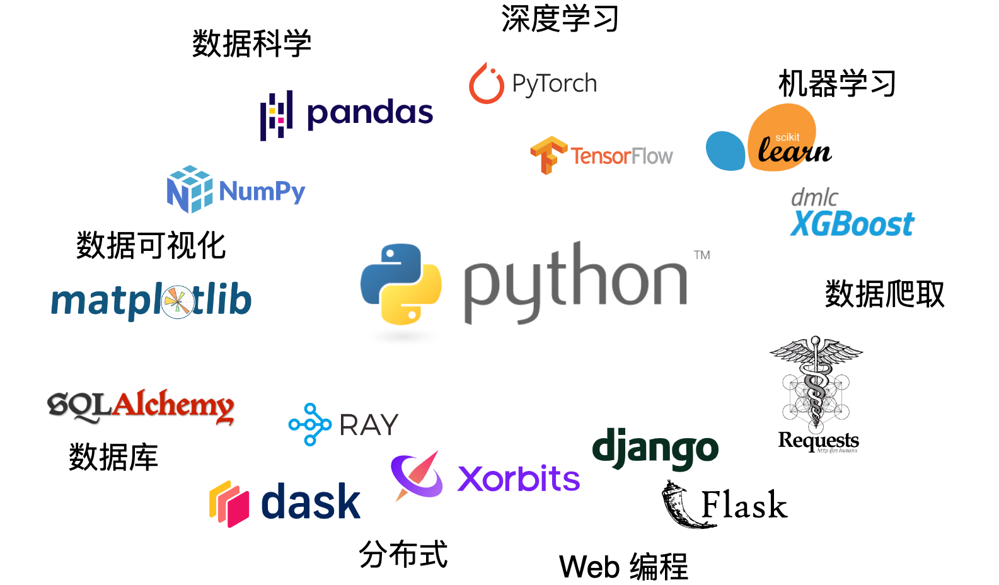

## Python：最为流行的编程语言

Python 是当前最流行的编程语言，近年来一直占据 [TOBIE](https://www.tiobe.com/tiobe-index/) 编程语言排行榜的第一名。它由 Guido van Rossum 于 1989 年创建并于 1991 年首次发布。Python 的设计哲学强调代码的可读性和简洁性，语法允许程序员用更少的代码表达想法。相比其他语言如 Java 或 C++， Python 更更简单易学。

Python 是一种通用编程语言，可以用于各种类型的软件开发。它广泛用于数据科学、机器学习、深度学习、Web 开发、网络编程等领域。Python 还支持多种编程范式，包括过程式、面向对象和函数式编程。

Python 的主要特点是其丰富的生态系统。它有大量的库，如图1.1所示。

* NumPy 和 pandas 用于数据处理和科学计算
* Matplotlib 用于数据可视化
* scikit-learn 和 XGBoost 用于机器学习
* PyTorch 和 TensorFlow 用于深度学习
* Django 和 Flask 用于 Web 开发
* SQLAlchemy 用于数据库连接
* Dask、 Ray 和 Xorbits 用于分布式和大数据
* requests 用于数据爬取和网络开发

以上仅列举了 Python 生态系统中的一小部分，还有大量库未被本书提及，以及大量的库基于这些库做了进一步的封装。这些库大大扩展了 Python 的功能，使其能够应对各种复杂的业务场景。

Python 又经常被称为“胶水语言”，这是因为它可以将多种编程语言编写的代码或者模块“粘合”在一起运行。Python 的胶水特性主要表现在以下几个方面：

* 跨平台特性：Python 可以在多种操作系统上运行，包括 Windows、Linux、macOS 等。这使得在不同平台上开发的代码可以无缝对接。

* 扩展性：Python 提供了丰富的接口，可以方便地调用 C、C++ 或 Java 等其他语言编写的代码。这使得 Python 可以利用其他语言的优势，如 C、C++ 的高效性能，Java 的跨平台特性等。

* 脚本语言特性：作为一种解释型语言，Python 可以很方便地进行脚本编写，用于自动化和快速原型开发。这使得 Python 可以方便地将各种任务“粘合”在一起。

综上，Python 在近些年来逐渐流行，主要因为：

* Python 对初学者非常友好。Python 的语法简单直观，几乎就像是用英语写的，学习曲线平缓，这使得它成为许多初学者学习编程的首选语言。
* Python 丰富的生态系统，尤其 Python 社区在数据科学、机器学习和人工智能领域提供了众多包，这些包或者是被科学家用于数据分析建模，或者被广泛部署在工业界的生产系统，经受了学术圈和工业界的检验。
* Python 语言的“胶水”特性。Python 近似脚本语言的特点，可以将不同操作系统、编程语言和任务粘合在一起，快速开发一个原型系统。

## Python 历史

Python 是由荷兰人 Guido van Rossum 开发。1989 年的圣诞节期间，为了在阿姆斯特丹打发时间，他决定开发一个新的脚本解释程序，作为 ABC 语言（一个源自荷兰的编程语言）的一种继承。之所以选中 Python 作为程序的名字，是因为他是蒙提·派森的飞行马戏团（Monty Python's Flying Circus）的忠实粉丝。蒙提·派森的飞行马戏团是一部由英国的喜剧团体蒙提·派森（Monty Python）制作的电视节目。这个节目以其独特的幽默风格和创新的电视制作技术而闻名，影响了许多后来的喜剧表演和电视节目。节目的内容包括各种荒诞和讽刺的短剧，以及动画插图。这些短剧通常打破了传统的喜剧规则，避免了常规的“冲突-解决”情节结构，而是采用了一种无厘头和不可预测的风格。在设计 Python 这门语言时，Guido van Rossum 希望这门语言既能够强大，又能够容易上手，还要足够有趣。他希望用户在使用 Python 编程时，能够有像看蒙提·派森的飞行马戏团那样的愉快体验。因此，Python 之父 Guido van Rossum 将新创建的语言以此命名，也是在向这个节目致敬。

Python 2.0 于 2000 年 10 月 16 日发布，增加了完整的垃圾回收机制，并且支持 Unicode。同时，整个开发过程更加透明，社区对开发进度的影响逐渐扩大。

Python 3.0 于 2008 年 12 月 3 日发布，此版不完全兼容之前的 Python 源代码，是一个破坏性的更新。

Python 2.x 在 2020 年 1 月 1 日之后，将不再有任何更新，包括安全补丁。因此，在 Python 社区，所有使用 Python 2.x 的用户都被强烈建议升级到 Python 3。

## Python 徽标：蟒蛇 

Python 语言的官方徽标（Logo） 是由两条蓝绿色的蛇形状组成，形状类似于道家的“阴阳”符号，两条蛇互相盘绕在一起，寓意平衡与和谐。Python 这个单词在英文中是“蟒蛇”的意思，这两条蛇也可以被视为蟒蛇的象征。因此，Python 的 Logo 与 Python 语言的名字相呼应。

蓝绿色的设计则给人一种清新、活力的感觉，这也反映了 Python 语言的设计理念——简洁、明了、易于理解和学习，具有很好的可读性。
